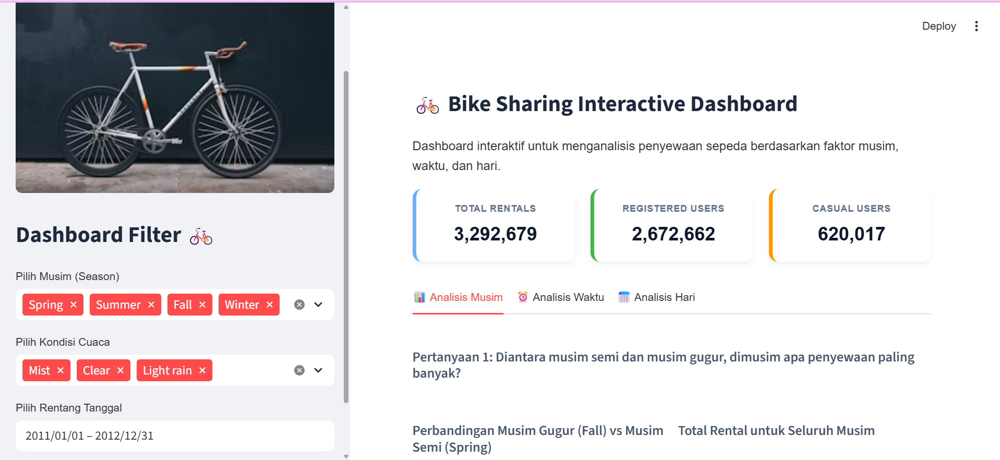

# 🚲 Bike Sharing Interactive Dashboard

Dashboard interaktif berbasis web menggunakan **Streamlit** untuk menganalisis dan memvisualisasikan data penyewaan sepeda berdasarkan dataset Bike Sharing. Proyek ini merupakan bagian dari analisis data untuk mengeksplorasi pengaruh faktor musim, waktu, dan hari terhadap tren penyewaan sepeda.

## Dashboard Preview

<p align="center">
    
</p>

## 🚀 Fitur Utama

- **Key Performance Indicators (KPIs):** Menampilkan metrik utama secara real-time seperti Total Penyewaan, Pengguna Terdaftar (*Registered*), dan Pengguna Biasa (*Casual*).
- **Filter Dinamis:**
  - **Pilih Musim & Kondisi Cuaca:** Filter multiselect untuk membatasi visualisasi berdasarkan musim (Spring, Summer, Fall, Winter) dan kondisi cuaca (Clear, Mist, Light rain).
  - **Rentang Tanggal Pintar:** Filter tanggal yang otomatis menyesuaikan batas minimum dan maksimum secara dinamis berdasarkan musim dan kondisi cuaca yang dipilih.
- **Visualisasi Interaktif (Plotly):**
  - **Analisis Musim:** Perbandingan penyewaan antara Musim Semi & Gugur serta kontribusi semua musim secara keseluruhan.
  - **Analisis Waktu:** Distribusi penyewaan per jam untuk pengguna terdaftar (*Registered*) lengkap dengan penanda jam sibuk (*Peak Hour*).
  - **Analisis Hari:** Persentase sebaran penyewaan pada hari kerja (*Weekday*) vs akhir pekan (*Weekend*).
  - **Interaktivitas Hover:** Arahkan kursor ke grafik untuk memunculkan detail angka/jumlah penyewaan secara presisi.
- **Lihat Detail Data:** Fitur expander untuk melihat dan mengeksplorasi tabel data mentah yang telah difilter.

---

## 📁 Struktur Repositori

```text
Analisis-bike-sharing/
│
├── data/
│   ├── day.csv                          # Dataset harian penyewaan sepeda
│   └── hour.csv                         # Dataset per jam penyewaan sepeda
│
├── Proyek_Analisis_Data_Bike_sharing.ipynb # Notebook Jupyter berisi analisis data & visualisasi awal
├── proyek_analisis_data_bike_sharing.py    # Skrip python hasil ekspor notebook
├── app.py                               # Kode utama aplikasi dashboard Streamlit
├── README.md                           
└── requirements.txt                   
```

---

## 🛠️ Cara Menjalankan Dashboard Secara Lokal

### 1. Persiapan Lingkungan (Environment Setup)
Pastikan Anda telah menginstal Python (versi 3.8 ke atas direkomendasikan). Buat dan aktifkan virtual environment:

```bash
# Membuat virtual environment
python -m venv venv

# Mengaktifkan virtual environment (Windows PowerShell)
.\venv\Scripts\Activate.ps1

# Mengaktifkan virtual environment (Mac/Linux)
source venv/bin/activate
```

### 2. Instalasi Library Dependensi
Instal pustaka Python yang diperlukan untuk proyek ini:

```bash
pip install streamlit pandas numpy matplotlib seaborn plotly
```

### 3. Menjalankan Aplikasi Streamlit
Jalankan perintah berikut pada terminal di dalam direktori proyek:

```bash
streamlit run app.py
```

Setelah dijalankan, aplikasi dashboard akan otomatis terbuka di browser default Anda pada alamat `http://localhost:8501`.

---

## 💡 Insight Singkat dari Analisis

1. **Pengaruh Musim:** Penyewaan sepeda mencapai puncaknya pada **Musim Gugur (Fall)**, diikuti oleh Summer, Winter, dan yang terendah pada **Musim Semi (Spring)**.
2. **Jam Puncak:** Penyewaan sepeda paling tinggi oleh pengguna terdaftar terjadi pada jam pulang kerja (**17:00**) dan jam berangkat kerja (**08:00**).
3. **Kategori Hari:** Sebagian besar penyewaan sepeda dilakukan pada hari kerja (*Weekday*) dibandingkan akhir pekan (*Weekend*).
